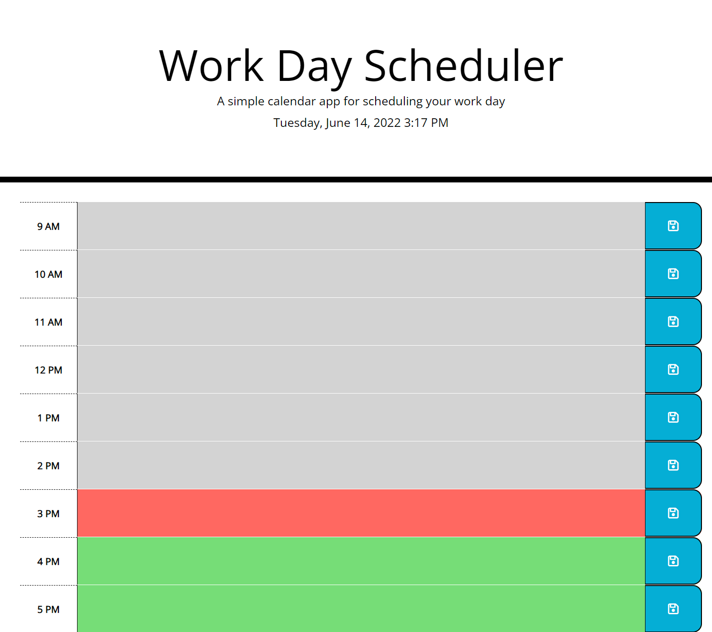

# Work Day Scheduler

For my bootcamp's assignment, I have created a simple calendar application that allows a user to save events for each working hour of the day. This app runs in the browser and features dynamically updated HTML and CSS powered by jQuery.

## About Assignment

For this assignment we were given starter code with some HTML and CSS styling already completed. I first edited the HTML to add timeblocks using bootstrap.

I then added a script.js page and used jQuery, JavaScript, and Moment.js to create functions linked the the HTML I had previously added.

As a final result, I now have a daily planner to create a schedule for my working day (9am - 5pm).

When the planner is openned, the current day is displayed at the top of the calendar. Further down the page, there are time blocks for the standard business hours. Each time block is color-boded to indicated whether it is in the past (grey), present (red), or future (green).

When you click in the time block, you can enter in an event or project description. When you press the save button for that time block, then the text is saved in localStorage, so if you refresh the page then the saved events persist.

## Link to Application

https://amymgardiner.github.io/Work-Day-Scheduler/
